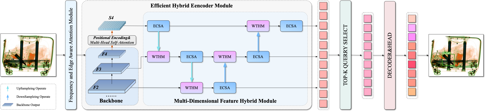
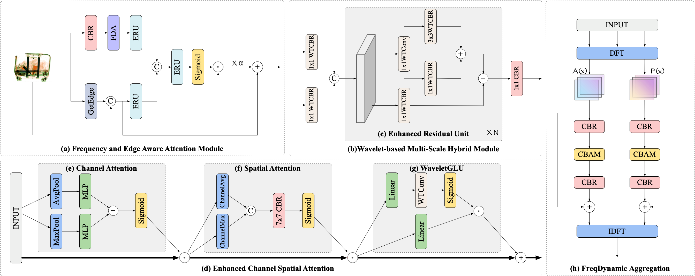

# FEADETR

This repository contains the official implementation of [FEA-DETR](https://ieeexplore.ieee.org/abstract/document/10889378/).

---

## Key Contributions

### Real-Time DETR-Based Model
We propose a real-time, end-to-end model tailored for detecting prohibited objects in baggage, ensuring high detection rates with minimal delay.

### Edge and Frequency Aware Attention Module (EFAM)
The EFAM module leverages both frequency domain and edge feature information to enhance recognition rates for occluded and overlapping objects, improving detection in challenging scenarios.

### Multi-Dimensional Feature Hybrid Module (MDFHM)
MDFHM efficiently synthesizes multi-scale features, achieving better feature integration while reducing computational resource consumption, making it suitable for real-time applications.

---
## Architecture

### Framework Diagram
The overall framework of FEA-DETR is illustrated in the diagram below:
  
*Figure: FEA-DETR Overall Framework*

### Module Diagram
The detailed design of the key modules, including EFAM and MDFHM, is depicted in the module diagram:
  
*Figure: EFAM and MDFHM Module Design*

---
## Installation

1. Clone the repository:
    ```bash
    git clone git@github.com:hong-shilong/FEA-DETR.git
    cd FEA-DETR
    ```

2. Install the required dependencies:
    ```bash
    conda create -n FEADETR -y
    conda activate FEADETR 
    conda install pytorch==2.0.1 torchvision==0.15.2 torchaudio==2.0.2 pytorch-cuda=11.8 -c pytorch -c nvidia -y
    pip install -r requirements.txt
    ```

---

## Usage

### Prepare Dataset

#### CLCXray Dataset  
Download the dataset from [CLCXray](https://github.com/GreysonPhoenix/CLCXray) and place it in the `datasets/clcxray` directory.

#### OPIXray Dataset  
Download the dataset from [PIDray](https://github.com/lutao2021/PIDray) and store it in the `datasets/pidray` directory.

Finally, update the `data_root` path in `configs/dataset/coco_detection.yml` to match the location of your dataset.

### Training

To train the model, run the following command:
```bash
torchrun --master_port=9999 --nproc_per_node=2  tools/train.py -c configs/config.yml
torchrun --master_port=9999 --nproc_per_node=1  tools/train.py -c configs/config.yml
python tools/train.py -c configs/config.yml
python tools/train.py -c configs/config.yml -r ./output/rtdetrv2_r50vd_6x_coco/map50_best.pth --test-only
```
---
## Repository Base

This repository is built upon [RT-DETR](https://github.com/lyuwenyu/RT-DETR). 
## Citation
If you use `FEA-DETR` in your work, please use the following BibTeX entries:
```
@inproceedings{hong2025fea,
  title={FEA-DETR: An Enhanced ConvNet for Detecting Prohibited Objects in X-Ray Images Using Frequency and Edge Aware Information},
  author={Hong, Shilong and Zhou, Yanzhou and Xu, Weichao},
  booktitle={ICASSP 2025-2025 IEEE International Conference on Acoustics, Speech and Signal Processing (ICASSP)},
  pages={1--5},
  year={2025},
  organization={IEEE}
}
```